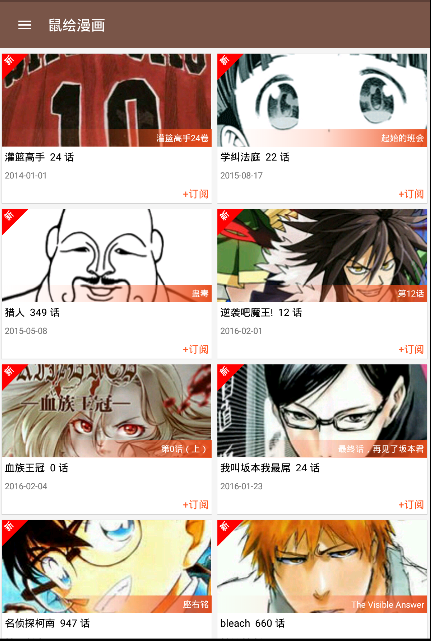
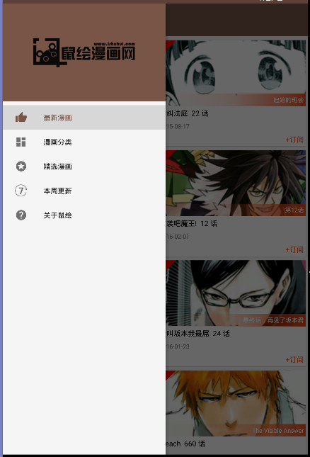
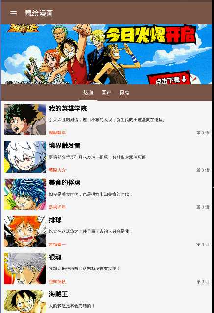
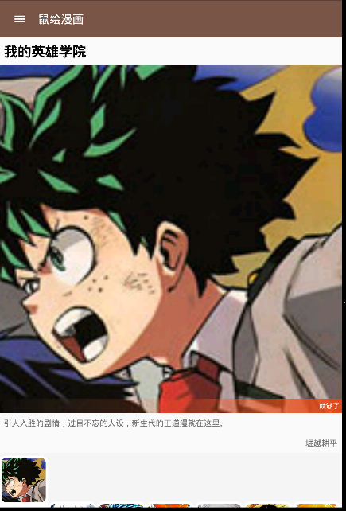
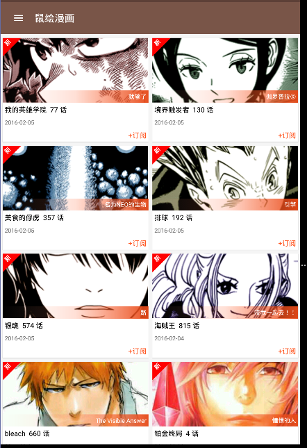
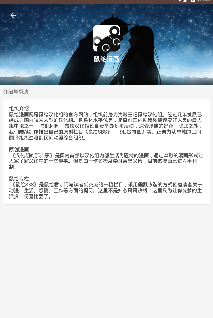

# IShuHui

利用鼠绘的接口，参考 MVP 架构开发的鼠绘漫画 App。

[APK 下载](http://fir.im/mwvp?release_id=56b4dbbd748aac718000000b)

#Snapshots

      

#参考/引用

[**MousePaint**](https://github.com/android-cjj/MousePaint)

> 最初灵感来源于此项目，但项目本身代码质量不高，很多部分很混乱，于是重构大部分代码，用MVP架构重新开发，完成本项目。在此感谢cjj的分享

[**Glide**](https://github.com/bumptech/glide)

[**okhttp**](https://github.com/square/okhttp)

[**ButterKnife**](https://github.com/JakeWharton/butterknife)

[**android-PullRefreshLayout**](https://github.com/baoyongzhang/android-PullRefreshLayout)

[**CircleIndicator**](https://github.com/ongakuer/CircleIndicator)

[**FloatingActionButton**](https://github.com/makovkastar/FloatingActionButton)

[**Android-Best-Practices**](https://github.com/tianzhijiexian/Android-Best-Practices)

License
============

    Copyright 2014 chaossss

	Licensed under the Apache License, Version 2.0 (the "License");
	you may not use this file except in compliance with the License.
	You may obtain a copy of the License at

     http://www.apache.org/licenses/LICENSE-2.0

	Unless required by applicable law or agreed to in writing, software
	distributed under the License is distributed on an "AS IS" BASIS,
	WITHOUT WARRANTIES OR CONDITIONS OF ANY KIND, either express or implied.
	See the License for the specific language governing permissions and
	limitations under the License.
